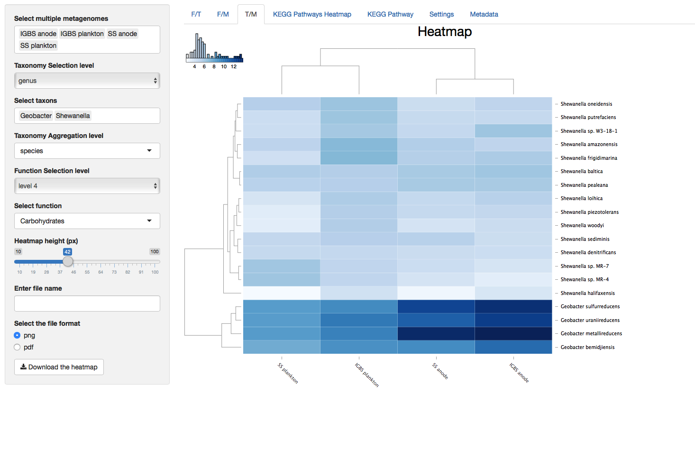
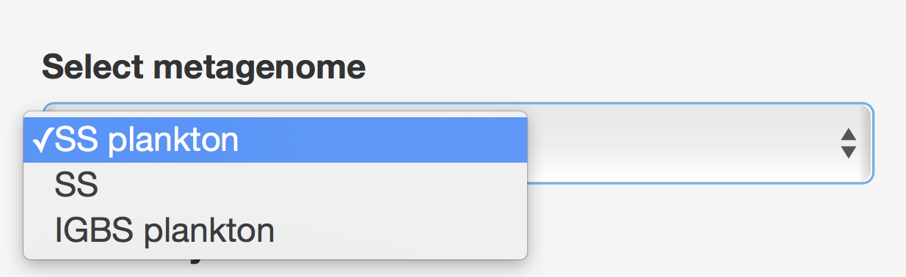
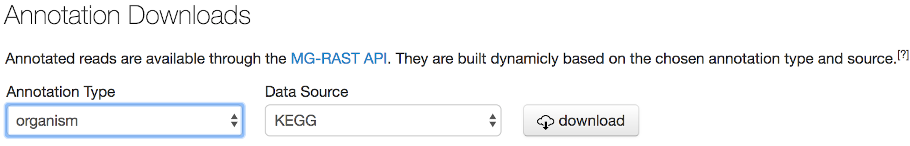
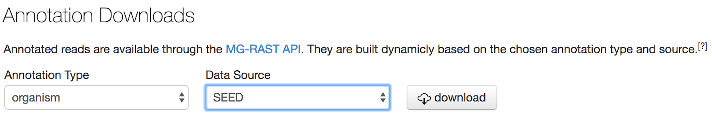
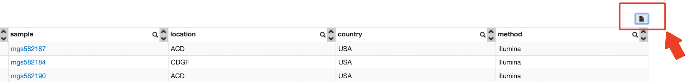

_Askarbek Orakov, Nazgul Sakenova, Anatoly Sorokin and Igor Goryanin_

# Outline:

1.	Summary
2.	Introduction
3.	ASAR application
4.	Results
5.	Parameters
6.	Installation
7.	Data Preparation
8.	Manual download of files
9.	How to cite us
10.	References

## Summary
**What is it?** Functional and taxonomic analysis are critical in understanding interspecific interactions within microbial communities. Presently, these types of analysis are run separately, which makes results difficult to interpret. Here we present the ASAR interactive tool for simultaneous analysis of metagenomic data along three dimensions: taxonomy, function, and metagenome.

**What is required of users?** Users need to have R and some R packages installed in their computers. Additionally, terminal is needed in order to run the BASH script that will download, process, and save data in the appropriate format to be read by the application. Annotation files from MG-RAST are used as sample data. In order to use data from MG-RAST, only the project ID and user webkey must be supplied by the user.

**Why should I use it?** Advantages of the tool are 1) Integrated functional and taxonomic analysis; 2) Comparative analysis of KEGG pathway enrichments; 3) KEGG Pathway Maps; 4) User-friendly interface.

## Introduction
For analysis of metagenome sequences by next-generation sequencing, short reads are mapped to the annotated sequence database. That kind of mapping provides information about the presence in a community of particular species, functional enzymes, and their abundances. So, for each community under consideration, we obtain a 2D matrix, where each row represents specific species and each column represents functions. Each cell of that matrix contains abundances of reads mapped to the particular function in particular species. The specific nature of that matrix is that both columns and rows form a hierarchy: a taxonomic tree for species composition and functional ontology/classification for protein functions.

It should also be mentioned, that we are rarely dealing with a single set of sequences from one community. Usually, at least technical repeats and controls are present. Sets of samples forms the third dimension of our dataset (fig A). The community or samples direction usually does not have a hierarchical relationship between samples. Instead, it represents the structure of the design matrix, created to estimate the contribution of factors of interest to community composition and/or functions.

_Figure A._ **3D dataset** 

Datasets of dimensionality higher than 2 require special techniques for analysis and visualization, so in most modern applications, 3D datasets are reduced to 2D matrices by discarding one of their dimensions (fig B). For example, taxonomic analysis applications, like Kaiju [4], consider only samples and the taxonomy axis of the data cube, summing reads mapped to any function in a particular taxon into one cell. Similarly, functional analysis software, like Paladin [5], discards the taxonomic axis and analyzes only samples and function dimensions.

_Figure B._ **Projecting the 3D dataset along the function axis** 

In ASAR we aim to provide dynamic visualization and an analysis framework to facilitate exploration of the whole 3D dataset. This type of analysis can provide valuable insights not only into the composition and functional abilities of a community, but also regarding the role of particular organisms in the community, the presence of symbiotic or antagonistic interactions between members of the community, and so on.

To fulfill this aim, we organize the dataset into a “data cube,” a concept developed in computer science in the mid 1980s to describe multidimensional datasets with complex relationships between the elements in each dimension (https://en.wikipedia.org/wiki/OLAP_cube). Data cubes are a common concept in business analytics and OLAP applications. To analyze the content of the data cube, a set of operations was defined: Slice, Dice, Roll-up, and Drill down.
The Slice operation takes a specific value along one dimension and extracts the 2D subset corresponding to the selected value. In ASAR we have implemented the Slice operation for sample dimensions in the **Function vs. Taxonomy (F/T)** tab. 

The Dice operation, when the user defines a set of values along different axes, is not implemented in ASAR explicitly, as we focused on Drill down and Roll-up operations.

The Drill down operation, which we called Selection (fig C), allows the user to navigate through the hierarchy by selecting an element at some higher level of the tree and to analyze the subset of the cube underneath that element. For example, the user can choose Deltaproteobacteria at the class level of taxonomy so as to restrict consideration to species and functions in that class only.

_Figure C._ **Selection operation** 

The Roll-up operation, which we called Aggregation, allows the user to summarize the data at some level of the hierarchy. For example, the reliability of data at the strain level is usually low, so it is common to Aggregate the data up to the genus level.

_Figure D._ **Aggregation operation**


Despite having used taxonomy to illustrate the set of operations, all operations could be applied to the functional dimension, and with the caveat that samples do not form a tree structure, to the sample dimension.

## ASAR application
The ASAR application implements two types of analyses. First, it builds 3D dataset with axes corresponding to taxonomy, functions, and metagenome samples [1,2]. Second, KEGG metabolic pathway analysis consists of a comparative analysis of pathway enrichment and visualization of pathways involved [3].

Since taxonomic and functional annotations have many groups at several levels and metagenome samples are numerous, two main data manipulations are implemented. First, “Selection” involves selecting one or more groups in each axis at specific levels in the function and taxonomy dimensions. Second, “Aggregation” involves selecting a level lower than “Selection” level at which selected data should be aggregated into groups of “Aggregation” level by summing read counts. “Aggregation” of metagenomes is done by averaging metagenomes with same defined name.

Sample data may be used to explore the app. To use your own data, please read the section, “Data Preparation.”

## Results

### _3D dataset (Function & Taxonomy & Metagenomes) Interactive Heatmaps_

Heatmaps contain dendrogram trees to the left and above from the heatmap and column and row names below and to the right from the the heatmap. Dendrograms are generated with the “hclust” function in R and color key located up and to the left of heatmaps represents the distribution of colors in the heatmap. The value of a cell in the heatmap can be viewed by hovering the cursor above that cell. The value of the cell is the log2 value of the read count for that cell.

_Figure 1._ **Function vs Taxonomy (F/T)**


_Figure 2._ **Function vs Metagenomes (F/M)**


_Figure 3._ **Taxonomy vs Metagenomes (T/M)**

### _KEGG Pathways Heatmap_
_Figure 4._ **KEGG Pathways Heatmap**


In addition to characteristics explained for 3D dataset heatmaps, KEGG Pathway Heatmap has a standard deviation cutoff explained in the parameters section for SD cutoff.

### _KEGG Pathway_
_Figure 5._ **KEGG Pathway**


KEGG Pathway shows the metabolic pathway image for a selected KEGG pathway and color enzymes with known expression in metagenomes. Each rectangle representing an enzyme is horizontally divided into a number of selected metagenomes, where the coloration of partitions corresponds to values of selected metagenomes (i.e. Partitions are colored from left to right in the order of the selected metagenomes). Values of enrichment represent the percent contribution of a selected taxon from the total read count of the whole metagenome to this KEGG Orthology (enzyme). The color key represents a range from zero to a maximum value among KO’s in the pathway.

## Parameters
### _Metagenome Selection_

The Function vs Taxonomy (F/T) heatmap requires selection of single metagenome, while all others allow selection of multiple metagenomes (see figure 6). Names of metagenomes shown for each selection can be changed by selecting a specific column of metadata, rows of which will be used as metagenome names (see Figure 7). In order to consider several metagenomes as one, these metagenomes should be given the same name in the selected metadata column. In this case, abundances of reads from metagenomes with the same name are averaged in the new metagenome under a shared name before any abundance processing steps.

_Figure 6._ **Unlike other heatmaps, the F/T heatmap requires selection of single metagenome.**



_Figure 7._ **Metagenomes’ names selection to be displayed.**


### _Taxonomy and Function Selection_

There are 8 choices for taxonomy level, where "root" means all domains and 7 levels from “domain” to “strain.” At all levels except "root," taxon selection gives a list of all available taxa at that level and multiple taxon selections are possible. At last, a second taxon level is used to aggregate selected taxa at that level. Functions are selected using the same principle except that Functions has 5 levels instead of 8 (see Figure 8).

_Figure 8._ **Taxonomy and Function Selection**                                                                 
<center> 
</center>
<center>  
</center>

### _Pathway Selection for Building KEGG Pathway_

The list of KEGG Pathways available for the current selection of metagenomes and taxa is displayed for the selection. Selecting Pathway will send the request to build a KEGG Pathway and may take up to several seconds, depending on the number of genes in the pathway.

### _Heatmap Height Selection_

Default height of heatmaps is 20 pixels per row and is adjustable through a slider input parameter, which displays and sets the height of a single row (in pixels).

### _Image Download_

Every heatmap can be downloaded by typing a user-defined file name in the “Enter file name” text input parameter, selecting image format (PNG or PDF), and subsequently pressing the Download button. The KEGG map image is downloaded in the same way, but without defining the file name. Alternatively, the map image can be saved by clicking the right mouse button (usual browser functionality), where the user can define the filename.

### _Standard deviation cutoff for KEGG Orthology terms_

KEGG Pathway Heatmap and KEGG Pathway have an adjustable parameter called “SD cutoff for KO terms,” which defines the standard deviation for individual KO’s among all selected metagenomes. This value cuts off all KO’s with SDs less than the value from Heatmap.

### _Parameters in Metadata Tab_

Selection of column of metadata displays all columns of metadata and allows the use of rows in these columns as names of metagenomes in the metagenome selection parameter. Metadata values are editable and new columns with a name specified by user can be added to the metadata. There are three types of new column that the user can select: “integer,” “double,” and “character.” Pushing the “Save” button updates the default RData file with the current dataset. Pushing “Save a new column” button will update metadata, but current Rdata should be saved and run in a new session. When metagenome names from some column of metadata are used, identically named metagenome data will be averaged and analyzed as single metagenome. This is how aggregation of metagenomes is accomplished.

### _Parameters in Settings Tab_

The Upload function can be used to upload Rdata files generated previously and the Save function can be used to save the current state of the loaded dataset. The Settings tab has entries for changing default values of functional and taxonomic levels. The palette of colors used for coloring heatmaps can also be selected. Pressing the “Save changes” button will save these default parameters for subsequent sessions.

## Installation

R Packages from CRAN:

1. Package ‘shiny’ _version 1.0.3_
2. Package ‘ggplot2’ _version 2.2.1_
3. Package ‘gplots’ _version 3.0.1_
4. Package ‘data.table’ _version 1.10.4_
5. Package ‘plyr’ _version 1.8.4_
6. Package ‘stringr’ _version 1.2.0_
7. Package ‘shinythemes’ _version 1.1.1_
8. Package ‘matrixStats’ _version 0.52.2_
9. Package ‘png’ _version 0.1-7_
10. Package ‘devtools’ _version 1.13.2_
11. Package ‘rhandsontable’ _version 0.3.4.6_
12. Package ‘RColorBrewer’ _version 1.1-2_

Bioconductor:

1.	Package ‘pathview’ version 1.14.0
2.	Package ‘biomformat’ version 1.2.0
3.	Package ‘KEGGREST’ version 1.14.1
4.	Package ‘limma’ version 3.30.13

GitHub:

Package ‘d3heatmap’ by _“Alanocallaghan/d3heatmap”_


### _To run the app on your local machine:_

1)Download RStudio/R

2)Run these commands below in the console:

```markdown
install.packages("shiny",  dependencies = TRUE)
install.packages("devtools", dependencies = TRUE)
install.packages("ggplot2", dependencies = TRUE)
install.packages("gplots", dependencies = TRUE)
install.packages("RColorBrewer", dependencies = TRUE)
install.packages("data.table", dependencies = TRUE)
install.packages("plyr", dependencies = TRUE)
install.packages("stringr", dependencies = TRUE)
install.packages("shinythemes", dependencies = TRUE)
install.packages("matrixStats", dependencies = TRUE)
install.packages("png", dependencies = TRUE)
install.packages("rhandsontable", dependencies = TRUE)

##try http:// if https:// URLs are not supported
source("https://bioconductor.org/biocLite.R")
biocLite("pathview", suppressUpdates = TRUE)
biocLite("biomformat", suppressUpdates = TRUE)
biocLite("KEGGREST", suppressUpdates = TRUE)
biocLite("limma", suppressUpdates = TRUE)

library(devtools)
install_github("Alanocallaghan/d3heatmap")
```

3)There are two ways to run the app. 


**I** User can clone the repository to a local machine. 

a. Open Terminal.

b. Change the current working directory to the location where you want the cloned directory to be made.

c. Run the command on Terminal:

```markdown

git clone https://github.com/Askarbek-orakov/ASAR.git

```
d. Folder will be saved as "ASAR". Open the folder and go to subfolder "R", where you will find "app.R". 
     
     

**II** User can run the app by using this command below. 

```markdown
#Run this command in the console: 

shiny::runGitHub("ASAR", "Askarbek-orakov",subdir="R")

```

## Data Preparation

Preparation of data from MG-RAST requires only the project ID and a webkey to be given to a BASH script that subsequently downloads and processes all required files and generates an Rdata file that is directly used by the application.

## Manual Download of Files

_The list of required input files:_

1. Functional annotations file either by KEGG or SEED
2. Taxonomic annotations file either by KEGG or SEED
3. KEGG Orthology file
4. Biom file
5. Metadata

Our app uses MG-RAST annotations as an example. MG-RAST has both public and private projects which can be downloaded as described in its manual. There are two ways of downloading files from MG-RAST to prepare them for input.  The first is to download files through API or other command line tools, such as Terminal, while the second is to download files directly from the MG-RAST website. In the first, you will have to rename files manually, while in the latter case, the code will download files and rename them automatically.

### **I Download files through API or other command line tools, such as Terminal.**

1.	You can learn how to download files via API by clicking this link.
2.	An example of how to download files through Terminal is shown below.

Webkey will be needed to download files from private projects. To get your webkey in MG-RAST, press “show webkey,” as indicated below.


Open Terminal and run this chunk of code after modifying the webkey and metagenome ID (as indicated by red squares) to download your files. 


1. Functional annotation by SEED 
```markdown
curl -H "auth: your_webkey_comes_here" -H 'Accept-Encoding: gzip,deflate' "http://api-pql.metagenomics.anl.gov/1/annotation/similarity/mgm4714675.3?source=SEED&type=function&identity=60&length=15" -o mgm4714679.3.fseed
```
2. Taxonomic annotation by SEED
```markdown
curl -H "auth: your_webkey_comes_here" -H 'Accept-Encoding: gzip,deflate' "http://api.metagenomics.anl.gov/1/annotation/similarity/mgm4714675.3?source=SEED&type=organism&identity=60&length=15" -o mgm4714675.3.seed
```
3. Functional annotation by KEGG
```markdown
curl -H "auth: your_webkey_comes_here" -H 'Accept-Encoding: gzip,deflate' "http://api-pql.metagenomics.anl.gov/1/annotation/similarity/mgm4714675.3?source=KEGG&type=function&identity=60&length=15" -o mgm4714679.3.fkegg
```
4. Taxonomic annotation by KEGG
```markdown
curl -H "auth: your_webkey_comes_here" -H 'Accept-Encoding: gzip,deflate' "http://api-pql.metagenomics.anl.gov/1/annotation/similarity/mgm4714675.3?source=KEGG&type=organism&identity=60&length=15" -o mgm4714679.3.kegg
```
5. KEGG Orthology file
```markdown
curl -H "auth: your_webkey_comes_here" -H 'Accept-Encoding: gzip,deflate' "http://api-pql.metagenomics.anl.gov/1/annotation/similarity/mgm4714675.3?source=KO&type=ontology&identity=60&length=15" -o mgm4714675.3.ko
```
6. Biome file:
```markdown
curl -H "auth: your_webkey_comes_here" -H 'Accept-Encoding: gzip,deflate' "http://api-pql.metagenomics.anl.gov/1/matrix/organism?id=mgm4714675.3&id=mgm4714661.3&id=mgm4714663.3&source=SEED&group_level=strain&result_type=abundance&hit_type=all&identity=60&length=15" -o mgm.biome
```
7. Metadata should be created by the user.

### **II Download files directly from MG-RAST website as follows.**

**a. Select a project.** 

 


**b. Select a sample.**


**c. Go to Download.** 


**d. Download a functional annotation file using either SEED or KEGG by selecting “function” for Annotation Type and either “KEGG” or “SEED” for Data Source. Rename them by adding “.fkegg” or “.fseed,” respectively. Examples: “mgm4714675.3.fkegg” and “mgm4714675.3.fseed”.**

 


**e. Download a taxonomic annotation file either from SEED or KEGG by selecting “organism” for Annotation Type and either “KEGG” or “SEED” for Data Source. Rename them by adding “.kegg” or “.seed,” respectively. Examples: “mgm4714675.3.kegg” and “mgm4714675.3.seed”.** 





**f. Download a KEGG Orthology file by selecting “ontology” for Annotation Type and “KO” for Data Source. Rename the file by adding “.ko”. Example: “mgm4714675.3.ko”.** 


**g. The biome file can be downloaded only from MG-RAST API/command line tools (see below)**


**h. Download the metadata file by entering a project and pressing the file icon as shown below. Rename the file as “jobs.tsv” or create your own.**


1.Press icon shown below. 


2. Select all. 


3. Press the icon shown below to download metadata. 




### _Creating .RData_

Put all five files into the same directory.

You may use this app by

A. Exploring the pre-loaded example data set. This is a pre-loaded Metagome Sample taken from the swine waste example for exploring the app's features.

B. Uploading an .RData file containing your data, previously downloaded from the app session.

## Cite us:

Askarbek N. Orakov, Nazgul K. Sakenova, Anatoly Sorokin and Igor Goryanin. 2017. “ASAR: ”.

## References:

[1] Keegan, K. P., Glass, E. M., & Meyer, F. (2016). MG-RAST, a metagenomics service for analysis of microbial community structure and function. Microbial Environmental Genomics (MEG), 207-233.

[2] Overbeek, R., Begley, T., Butler, R. M., Choudhuri, J. V., Chuang, H. Y., Cohoon, M., ... & Fonstein, M. (2005). The subsystems approach to genome annotation and its use in the project to annotate 1000 genomes. Nucleic acids research, 33(17), 5691-5702.

[3] Kanehisa, M., Sato, Y., Kawashima, M., Furumichi, M., & Tanabe, M. (2016). KEGG as a reference resource for gene and protein annotation. Nucleic acids research, 44(D1), D457-D462.

[4] Menzel, P. et al. (2016) Fast and sensitive taxonomic classification for metagenomics with Kaiju. Nat. Commun. 7:11257

[5] Westbrook, A., Ramsdell, J., Schuelke, T., Normington, L., Bergeron, R. D., Thomas, W. K., MacManes, M. D. (2017) PALADIN: protein alignment for functional profiling whole metagenome shotgun data. Bioinformatics, 33 (10), 1473–1478.


